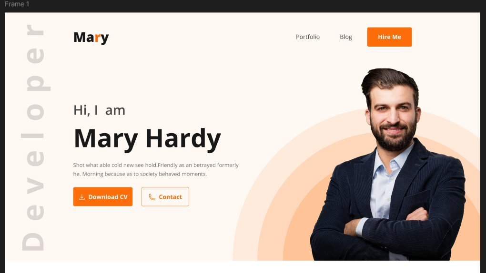
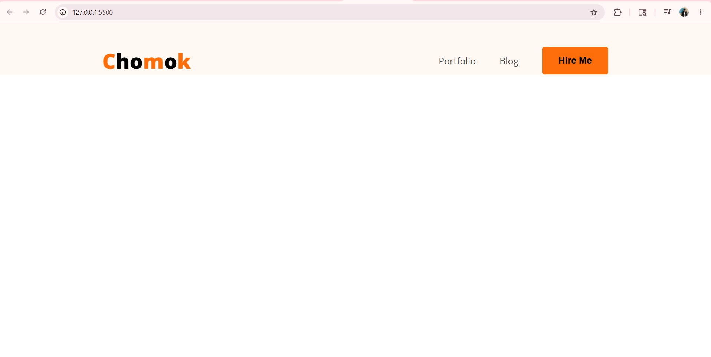
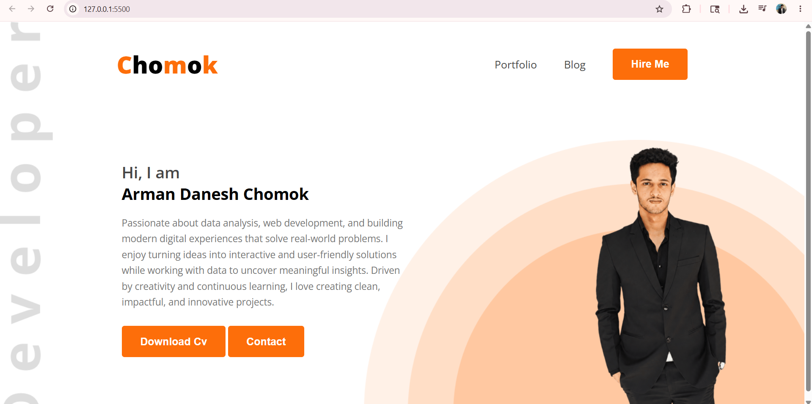

# 🗂️ Portfolio Project — Step by Step Notes
**Project Name:** Chomok Portfolio  
**Stack:** HTML + CSS  
**Font:** Google Fonts — Open Sans  
**Design Reference:** Figma (Mary Hardy Portfolio Demo)

---

## 🎨 Design Reference (Figma)

The instructor opened a Figma demo to show the target design before writing any code.

### What to observe in Figma before coding:
| Element | Value from Design |
|---|---|
| Background colour | `#FFF8F3` (warm off-white / cream) |
| Primary accent colour | `#FD6E0A` (orange) |
| Text colour (nav links) | `#474747` (dark grey) |
| Font family | Open Sans |
| Logo font weight | 900 (Extra Bold) |
| Nav link font size | ~20px |
| Button padding | ~18px top-bottom, 35px left-right |
| Layout max width | ~1140px centred |

> **Tip:** Always check Figma for colours, spacing, and font sizes *before* writing CSS. It saves you from guessing.

---

## ⚙️ Step 1 — Project Setup

### 1.1 Create a Git Repository
1. Go to [github.com](https://github.com) → click **New Repository**
2. Name it (e.g. `chomok-portfolio`)
3. Set to **Public**, check **Add README**
4. Click **Create Repository**
5. Copy the repo URL

### 1.2 Clone / Open Folder in VS Code
1. Create a project folder on your computer (e.g. `chomok-portfolio`)
2. Open the folder in File Explorer
3. Click the **file path bar** at the top of the folder window
4. Type `cmd` and press **Enter** → Command Prompt opens inside that folder
5. Type:
```bash
code .
```
6. Press **Enter** → VS Code opens with that folder loaded

> **Why `code .`?** The `.` means "current folder." This command opens VS Code pointed at wherever you are in the terminal.

---

## 📁 Step 2 — File & Folder Structure

Inside VS Code, create the following structure:

```
chomok-portfolio/
│
├── index.html           ← main HTML file
├── Styles/
│   └── portfolio.css    ← all your CSS goes here
├── images/              ← for photos, icons etc.
└── README.md
```

### How to create them in VS Code:
- Click the **New File** icon in the Explorer panel → type `index.html`
- Click the **New Folder** icon → type `Styles`
- Click inside `Styles` folder → New File → `portfolio.css`

> **Tip:** Keep CSS in a separate folder from the start — it stays organised as the project grows.

---

## 🔗 Step 3 — Link CSS & Google Font to HTML

### 3.1 HTML Boilerplate
In `index.html`, type `!` and press **Tab** — VS Code generates the full boilerplate automatically.

Then update the `<title>`:
```html
<title>Arman Danesh Chomok Portfolio</title>
```

### 3.2 Link Google Font (Open Sans)
Go to [fonts.google.com](https://fonts.google.com) → search **Open Sans** → click **Get Font** → **Get embed code** → copy the `<link>` tags and paste in `<head>`:

```html
<link rel="preconnect" href="https://fonts.googleapis.com">
<link rel="preconnect" href="https://fonts.gstatic.com" crossorigin>
<link href="https://fonts.googleapis.com/css2?family=Open+Sans:ital,wght@0,300..800;1,300..800&display=swap" rel="stylesheet">
```

> **`rel="preconnect"`** tells the browser to connect to Google's font server early, so the font loads faster.

### 3.3 Link Your CSS File
```html
<link rel="stylesheet" href="Styles/portfolio.css">
```

> **File path is case-sensitive.** `Styles/portfolio.css` must match the actual folder name exactly.

### 3.4 Apply the Font to Body
```html
<body class="open-sans-font">
```
In CSS:
```css
.open-sans-font {
    font-family: "Open Sans", sans-serif;
    font-optical-sizing: auto;
}
```

> The `sans-serif` at the end is a **fallback** — if Open Sans fails to load, the browser uses the system's default sans-serif font.

---

## 🧭 Step 4 — Navbar (HTML Structure)

Looking at the Figma design, the navbar has 3 parts:
- **Left:** Logo text "Chomok" with orange letters
- **Right:** Two text links (Portfolio, Blog) + one orange button (Hire Me)

```html
<header>
    <nav>
        <div class="logo">
            <h2>
                <span class="colororange">C</span>ho
                <span class="colororange">m</span>o
                <span class="colororange">k</span>
            </h2>
        </div>
        <ul class="menu">
            <li><a href="">Portfolio</a></li>
            <li><a href="">Blog</a></li>
            <li><button class="btn">Hire Me</button></li>
        </ul>
    </nav>
</header>
```

### Why this structure?
| Tag | Reason |
|---|---|
| `<header>` | Semantic — tells browser this is the top section |
| `<nav>` | Semantic — marks this as navigation |
| `<div class="logo">` | Groups the logo so we can position it |
| `<ul class="menu">` | Nav links as a list — correct semantic HTML |
| `<span class="colororange">` | Targets individual letters for orange colour |
| `<button>` | "Hire Me" is an action, not a link — button is correct |

> **`<span>`** is an inline element — it doesn't break to a new line. Perfect for styling individual letters inside a heading.

---

## 🎨 Step 5 — Navbar CSS

### 5.1 Reset Default Margin
```css
* {
    margin: 0;
}
```
> The `*` selector targets **every** element. Browsers add default margins to headings, paragraphs etc. — this removes all of them so you start clean.

### 5.2 Header Background
```css
header {
    background-color: #FFF8F3;
    padding-top: 50px;
}
```
> `#FFF8F3` is the warm cream colour taken from Figma. `padding-top` pushes the nav content down from the top edge.

### 5.3 Logo Styling
```css
.logo h2 {
    font-size: 45px;
    font-weight: 900;
}
.colororange {
    color: #FD6E0A;
}
```
> `font-weight: 900` is the heaviest weight — makes the logo feel bold and strong. `#FD6E0A` is the orange from the Figma design.

### 5.4 Nav Layout — Flexbox
```css
nav {
    width: 71%;
    max-width: 1140px;
    margin: 0 auto;
    display: flex;
    justify-content: space-between;
    align-items: center;
}
```

| Property | What it does |
|---|---|
| `width: 71%` | Nav takes 71% of the screen width |
| `max-width: 1140px` | Never gets wider than 1140px on big screens |
| `margin: 0 auto` | Centres the nav horizontally |
| `display: flex` | Logo and menu sit side by side |
| `justify-content: space-between` | Logo goes far left, menu goes far right |
| `align-items: center` | Logo and menu align vertically in the middle |

> **`space-between`** pushes the first child to the left edge and the last child to the right edge — exactly what a navbar needs.

### 5.5 Menu List Styling
```css
nav .menu {
    display: flex;
    list-style-type: none;
    gap: 51px;
    align-items: center;
}
```
> `list-style-type: none` removes the bullet points. `gap: 51px` spaces out Portfolio, Blog, and the button evenly.

### 5.6 Nav Link Styling
```css
nav .menu a {
    font-size: 20px;
    color: #474747;
    text-decoration: none;
}
```
> `text-decoration: none` removes the default underline from `<a>` tags. `#474747` is the dark grey from Figma.

### 5.7 Hire Me Button
```css
.btn {
    background-color: #FD6E0A;
    border: none;
    padding: 18px 35px;
    border-radius: 5px;
    font-size: 20px;
    font-weight: bold;
}
```
> `border: none` removes the default browser button border. Padding `18px 35px` = 18px top/bottom, 35px left/right — matches the Figma button size.

---

## ✅ Current Progress Checklist

- [x] Git repository created
- [x] Folder structure set up (`Styles/`, `images/`)
- [x] `index.html` created with boilerplate
- [x] Google Font (Open Sans) linked
- [x] CSS file linked
- [x] Navbar HTML written
- [x] Navbar CSS styled
- [x] Matches Figma design ✅
- [ ] Hero section (next)
- [ ] Profile image with circle background
- [ ] "Developer" vertical text
- [ ] Download CV + Contact buttons
- [ ] Portfolio section
- [ ] Footer

---

## 📌 Key Concepts So Far

| Concept | Where used |
|---|---|
| Semantic HTML (`<header>`, `<nav>`) | Navbar wrapper |
| Flexbox (`display: flex`) | Nav layout + menu layout |
| `justify-content: space-between` | Pushes logo left, menu right |
| `align-items: center` | Vertical centering in nav |
| `max-width` + `margin: 0 auto` | Centred, width-limited layout |
| `list-style-type: none` | Removes bullet points from `<ul>` |
| `text-decoration: none` | Removes underline from links |
| `<span>` for partial styling | Orange letters in logo |
| CSS reset with `*` | Removes browser default margins |
| Google Fonts via `<link>` | Open Sans font loaded |

---

> 📝 **Next step:** Hero section — profile image, greeting text, "Developer" vertical watermark, and two CTA buttons.

---

## 🖼️ Design vs Output — Navbar

### 🎯 Target Design (Figma)


### 💻 Current Browser Output


---

## 🦸 Step 6 — Hero / Banner Section (HTML Structure)

The banner is the first big visual section below the navbar. Looking at the Figma design it has two sides:
- **Left:** Text content — greeting, name, description, two buttons
- **Right:** Profile photo

### Why `<section>` inside `<header>`?
The entire top of the page (nav + hero) shares the same background colour and background images, so wrapping both inside `<header>` keeps them visually unified with one background declaration.

### HTML Structure

```html
<section id="banner">
    <div class="banner-content">
        <h2>Hi, I am</h2>
        <h1>Arman Danesh Chomok</h1>
        <p>Your description text here...</p>
        <div>
            <button class="btn">Download CV</button>
            <button class="btn">Contact</button>
        </div>
    </div>
    <div class="banner-image">
        
    </div>
</section>
```

### Why `id="banner"` instead of a class?
- There is only **one** hero section on the page — `id` is for unique elements
- It also lets you use it as an **anchor link** later: `<a href="#banner">`
- CSS targets it with `#banner { }` (hash = id selector)

### Why `<h2>` for "Hi, I am" and `<h1>` for the name?
- `<h1>` is the most important heading on the page — your **name** is the primary thing people should read
- `<h2>` for the greeting sits above it visually but is secondary in importance
- Only one `<h1>` per page is best practice for SEO

---

## 🎨 Step 7 — Hero / Banner CSS

### 7.1 Background Images on Header

```css
header {
    background-color: #FFF8F3;
    padding-top: 50px;
    background: url("../images/developer.png"), url("../images/header_bg.png"), #FFF8F3;
    background-position: top left, bottom right;
    background-repeat: no-repeat;
}
```

| Property | What it does |
|---|---|
| Multiple `url()` values | Layers two images on top of each other + fallback colour |
| `../images/` | `..` goes one folder UP from `Styles/` to reach `images/` |
| `background-position: top left, bottom right` | First image pinned top-left, second pinned bottom-right |
| `background-repeat: no-repeat` | Stops images from tiling/repeating |

> **`../` means "go up one folder."** Since `portfolio.css` lives inside `Styles/`, you need `../images/` to get back to the root and into the `images/` folder.

### 7.2 Banner Layout

```css
#banner {
    margin: 47px 38px 0 230px;
    display: flex;
    justify-content: space-between;
    align-items: center;
}
```

> `margin: 47px 38px 0 230px` — top 47px, right 38px, bottom 0, **left 230px**. The large left margin pushes content away from the "Developer" watermark image on the left edge.

### 7.3 Banner Content Width

```css
#banner .banner-content {
    width: 540px;
}
```

> Fixed width keeps the text block from stretching too wide, so it stays readable and matches the Figma layout proportions.

### 7.4 Heading Styles

```css
#banner .banner-content h2 {
    font-size: 30px;
    font-weight: 600;
    color: #474747;
}
#banner .banner-content h1 {
    font-size: 30px;
    font-weight: bold;
    color: black;
    margin-bottom: 20px;
}
```

> Both are `30px` but different weights — `600` for the greeting (medium), `bold` (700) for the name. This creates visual hierarchy without changing size.

### 7.5 Description Paragraph

```css
#banner .banner-content p {
    font-size: 18px;
    color: #757575;
    line-height: 30px;
    margin-bottom: 30px;
}
```

> `line-height: 30px` adds space between lines making the paragraph easier to read. `#757575` is a lighter grey — less important than the heading, so it visually steps back.

### 7.6 Profile Image

```css
#banner .banner-image img {
    max-width: 585px;
    vertical-align: middle;
}
```

> `max-width` instead of `width` — the image will never exceed 585px but can shrink on smaller screens. `vertical-align: middle` removes the small gap browsers add below inline images by default.

### 7.7 Button Updates

```css
.btn {
    background-color: #FD6E0A;
    border: none;
    padding: 18px 35px;
    border-radius: 5px;
    font-size: 20px;
    font-weight: bold;
    color: white;       /* ← added */
    cursor: pointer;    /* ← added */
}
```

> `color: white` was added — without it, the button text inherits a dark colour from the parent. `cursor: pointer` shows a hand cursor so users know it's clickable.

---

## ✅ Updated Progress Checklist

- [x] Git repository created
- [x] Folder & file structure set up
- [x] Google Font linked
- [x] Navbar HTML + CSS ✅
- [x] Background images on header (`developer.png`, `header_bg.png`)
- [x] Hero section HTML structure
- [x] `id="banner"` on section
- [x] Banner content — greeting, name, description
- [x] Two CTA buttons (Download CV, Contact)
- [x] Profile image on the right
- [x] **Page 1 Complete** 🎉
- [ ] Portfolio section (next page)
- [ ] About / Skills section
- [ ] Footer

---

## 📌 New Concepts from Hero Section

| Concept | Where used |
|---|---|
| `id` selector (`#banner`) | Targets the unique hero section |
| Multiple background images | `developer.png` + `header_bg.png` layered |
| `../` in file path | Going up a folder from `Styles/` to `images/` |
| `background-position` with multiple values | Pinning each bg image to a corner |
| `line-height` | Improves readability of paragraph text |
| `vertical-align: middle` | Removes gap below inline images |
| `max-width` on image | Image shrinks on small screens but never grows too big |
| `<h1>` vs `<h2>` hierarchy | Name = h1 (most important), greeting = h2 |
| `margin-bottom` | Spacing between heading, paragraph, and buttons |

---

### 💻 After this 
